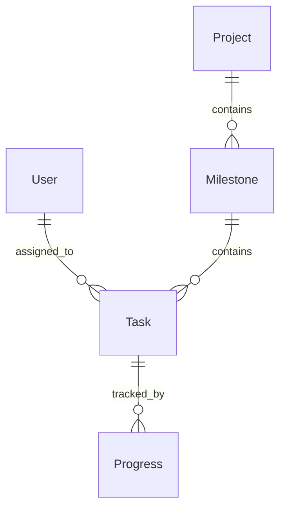
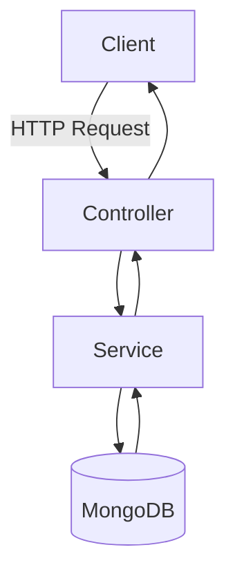
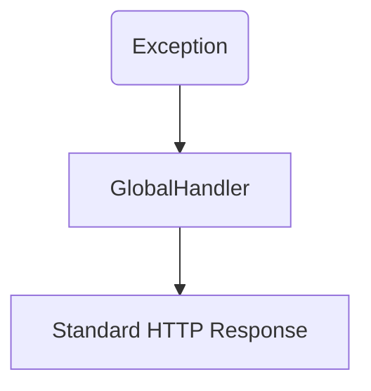
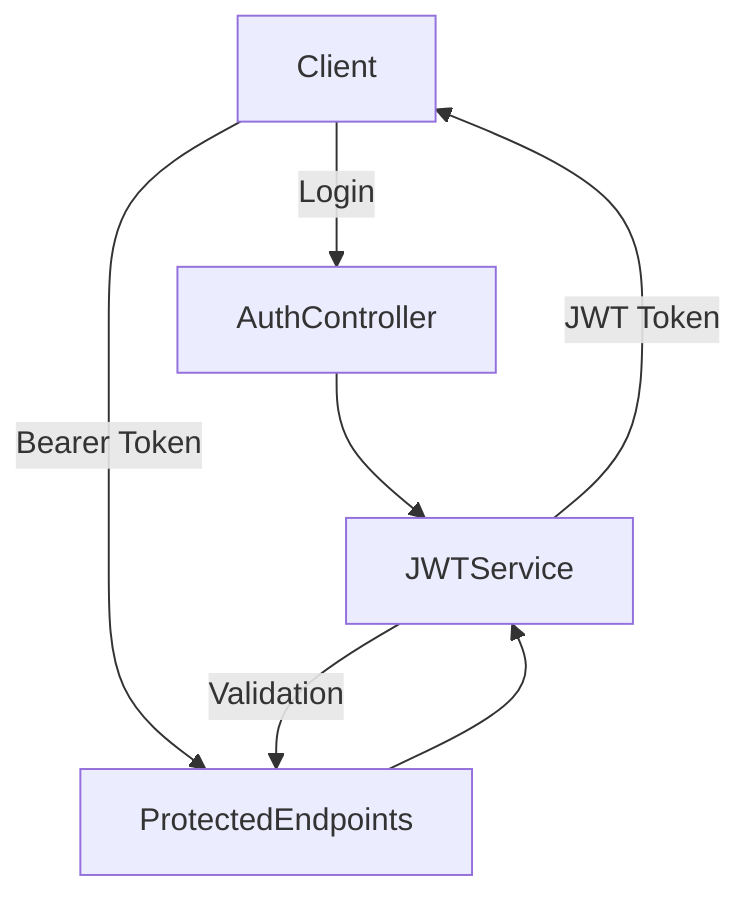

<!--https://final-api-fr66.onrender.com/docs
-->

<!--
**Owner:** KamoEllen
**Category:** Backend
**Repo:** [project-management-api-v2](https://github.com/KamoEllen/project-management-api-v2)
**Status:** Completed
-->

## Table of Contents

1. [Introduction](#introduction)
2. [Features](#features)

   * [User Authentication & Authorization](#user-authentication--authorization)
   * [User Management](#user-management)
   * [Milestone Management](#milestone-management)
   * [Task Management](#task-management)
   * [Progress Tracking](#progress-tracking)
3. [Core Functionality](#core-functionality)
4. [Architecture](#architecture)

   * [Layered Architecture](#layered-architecture)
   * [Package Structure](#package-structure)
   * [Data Relationships](#data-relationships)
   * [Request & Exception Flow](#request--exception-flow)
5. [Technology Stack](#technology-stack)
6. [Quick Start](#quick-start)

   * [Prerequisites](#prerequisites)
   * [Installation](#installation)
   * [Running the Application](#running-the-application)
   * [Accessing the API](#accessing-the-api)
   * [Running Tests](#running-tests)
7. [Contributing](#contributing)

---

## Introduction

The **Project Management API v2** is a FastAPI-based backend service designed for managing **projects, milestones, tasks, and user progress tracking**.
It supports **JWT-based authentication**, secure password hashing, and full CRUD operations for all resources.

---

## Features

### User Authentication & Authorization

* JWT token-based authentication
* Secure password storage with bcrypt
* Token expiration management (15–30 minutes)

### User Management

* Register, retrieve, update, and delete users
* Validation and error handling

### Milestone Management

* Create, read, update, delete milestones
* Pagination support for lists

### Task Management

* Full CRUD operations for tasks
* Assign tasks to projects and users

### Progress Tracking

* Create and track user progress
* Retrieve entries by user or progress ID

---

## Core Functionality

### User Endpoints

| Method | Endpoint      | Description                  |
| ------ | ------------- | ---------------------------- |
| POST   | `/token`      | Authenticate & get JWT token |
| POST   | `/users/`     | Register a new user          |
| GET    | `/users/{id}` | Get user details             |
| PUT    | `/users/{id}` | Update user details          |
| DELETE | `/users/{id}` | Delete a user                |

### Milestone Endpoints

| Method | Endpoint            | Description                  |
| ------ | ------------------- | ---------------------------- |
| POST   | `/milestoness/`     | Create milestone             |
| GET    | `/milestoness/`     | List milestones (pagination) |
| GET    | `/milestoness/{id}` | Get milestone by ID          |
| PUT    | `/milestoness/{id}` | Update milestone by ID       |
| DELETE | `/milestoness/{id}` | Delete milestone             |

### Task Endpoints

| Method | Endpoint       | Description             |
| ------ | -------------- | ----------------------- |
| POST   | `/taskss/`     | Create a task           |
| GET    | `/taskss/`     | List tasks (pagination) |
| GET    | `/taskss/{id}` | Get task by ID          |
| PUT    | `/taskss/{id}` | Update task             |
| DELETE | `/taskss/{id}` | Delete task             |

### Progress Endpoints

| Method | Endpoint              | Description                 |
| ------ | --------------------- | --------------------------- |
| POST   | `/progress/`          | Create a progress entry     |
| GET    | `/progress/user/{id}` | List progress by user ID    |
| GET    | `/progress/{id}`      | Get a single progress entry |

---

## Architecture

### Layered Architecture

* **Controllers/Routes:** API request handling & validation
* **Services:** Business logic & orchestration
* **Database Layer:** MongoDB access via Motor (async)
* **Models/Entities:** Pydantic models and MongoDB documents
* **Auth:** JWT token generation and validation
* **Exceptions:** Centralized error handling

### Package Structure

```
app/
├── main.py         # FastAPI entrypoint
├── models/         # Pydantic models & DB documents
├── routes/         # API endpoints
├── services/       # Business logic
├── db/             # MongoDB connection
├── auth/           # JWT & authentication
└── utils/          # Helpers & error handlers
```

### Data Relationships



### Request & Exception Flow







---

## Technology Stack

**Backend**

* FastAPI
* Pydantic
* Motor (async MongoDB)
* Passlib (bcrypt)

**Database**

* MongoDB

**Documentation & Testing**

* Swagger UI (FastAPI)
* Pytest

**Development**

* Python 3.8+
* Virtual environment (venv)
* pip

---

## Quick Start

### Prerequisites

* Python 3.8+
* MongoDB
* pip

### Installation

```bash
git clone https://github.com/KamoEllen/project-management-api-v2.git
cd project-management-api-v2
python -m venv venv
source venv/bin/activate  # Windows: venv\Scripts\activate
pip install -r requirements.txt
```

### Running the Application

```bash
uvicorn app.main:app --reload
```

API will be available at: `http://127.0.0.1:8000`

### Accessing the API

* Swagger UI: `http://127.0.0.1:8000/docs`
* Redoc: `http://127.0.0.1:8000/redoc`

### Running Tests

```bash
pytest
```

---

## Contributing

1. Fork the repository
2. Create a feature branch
3. Implement changes
4. Commit changes
5. Push to branch
6. Open a Pull Request

